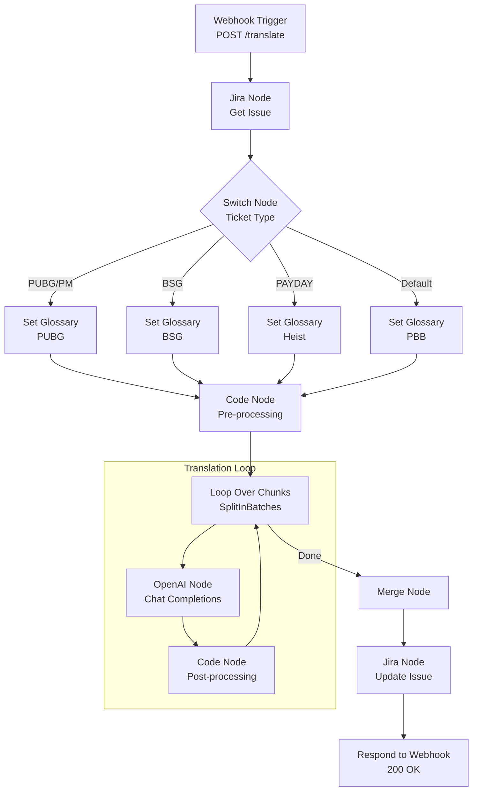

# Jira 번역기 N8N 마이그레이션 분석

이 문서는 기존 AWS Lambda 기반 Jira 번역기를 AWS 의존성 없이 순수 N8N 워크플로우로 전환하기 위한 분석 및 계획 문서입니다.

## 1. 실현 가능성 분석
**종합 점수: 높음 (9/10)**

N8N은 Jira 및 OpenAI와의 연동을 네이티브로 지원하므로 전환이 매우 용이합니다. 기존 프로젝트의 핵심인 **복잡한 텍스트 처리 로직**(마크업 보존, 국영문 혼용 처리 등)은 N8N의 **Python Code Node**를 사용하여 그대로 이식할 수 있습니다.

- **표준 노드 활용 (80%)**: 트리거, API 호출, 분기 처리 등 흐름 제어는 N8N의 시각적 노드로 대체합니다.
- **커스텀 로직 (20%)**: `formatting.py`에 있는 정규식 및 문자열 처리 로직은 Python Code Node에 붙여넣어 실행합니다.

## 2. N8N 도입 장점 (vs 기존 AWS Lambda)

- **AWS 완전 탈피**: 복잡한 IAM 권한 관리, Lambda 배포, API Gateway 설정이 필요 없습니다. N8N 서버 하나로 모든 것이 동작합니다.
- **직관적인 디버깅**: 데이터의 흐름을 시각적으로 볼 수 있어, 특정 티켓이 왜 번역에 실패했는지 추적하기 쉽습니다.
- **유연한 수정**: OpenAI 시스템 프롬프트 수정 등을 위해 코드를 다시 배포할 필요 없이, N8N UI에서 바로 수정 가능합니다.
- **확장성**: 슬랙(Slack) 알림, 이메일 발송 등 추가 기능을 드래그 앤 드롭으로 즉시 추가할 수 있습니다.

## 3. 제안하는 N8N 그래프 구조

모든 과정은 AWS 없이 N8N 내부에서만 실행됩니다.

### 워크플로우 시각화 (Flowchart)

### 메인 워크플로우 상세 내용

1.  **Webhook Trigger (POST)**
    - **역할**: 외부(Jira Automation 등)에서 요청을 받는 진입점입니다.
    - **URL**: `https://your-n8n-instance.com/webhook/translate`
    - **Method**: `POST`
    - **Input**: `issue_key` (필수)

2.  **Jira Node (Get Issue)**
    - **역할**: Jira API를 통해 이슈 정보를 조회합니다.
    - **설정**: `summary`, `description`, `customfield_10237` (Steps), `customfield_10399` (PBB Steps) 필드 조회

3.  **Switch Node (티켓 타입 분기)**
    - **역할**: `issue_key` 접두어에 따라 용어집(Glossary) 설정을 분기합니다.
    - **분기 로직**:
        - `PUBG-`, `PM-`: `pubg_glossary.json`
        - `PUBGXBSG-`: `bsg_glossary.json`
        - `PAYDAY-`: `heist_glossary.json`
        - 그 외: `pbb_glossary.json`

4.  **Read File / Set Variable Node (용어집 로드)**
    - **역할**: 분기된 설정에 맞는 용어집 데이터를 로드합니다.
    - **방법**: N8N 서버 로컬 파일에서 읽거나, GitHub Raw URL에서 HTTP Request로 가져옵니다.

5.  **Code Node (Python) - 전처리 (Pre-processing)**
    - **역할**: 텍스트 분석 및 번역 청크(Chunk) 생성
    - **주요 로직** (기존 Python 코드 이식):
        - `formatting.py`: 이미지/첨부파일 마크업 추출 (`!image.png!`) 및 플레이스홀더 치환
        - `language.py`: 이미 번역된 문단인지, 언어가 무엇인지 감지
    - **출력**: 번역이 필요한 텍스트 청크 리스트

6.  **Loop Over Chunks (SplitInBatches)**
    - **역할**: 텍스트 청크를 하나씩 순회하며 처리합니다.

7.  **OpenAI Node (Chat Completions)**
    - **역할**: 실제 번역 수행
    - **Model**: `gpt-4o` (또는 선호 모델)
    - **System Prompt**: 용어집 내용을 문맥으로 포함하여 번역 요청

8.  **Code Node (Python) - 후처리 (Post-processing)**
    - **역할**: 번역 결과 병합 및 마크업 복원
    - **주요 로직**:
        - 마크업 플레이스홀더를 원본 이미지 태그로 복구
        - 원본 문단과 번역 문단을 `Original / Translated` 또는 `{color}` 태그 형태로 병합

9.  **Merge Node**
    - **역할**: 쪼개서 처리된 청크들을 다시 하나의 이슈 데이터로 합칩니다.

10. **Jira Node (Update Issue)**
    - **역할**: 최종 완성된 번역문을 Jira 이슈에 업데이트합니다.
    - **Fields**: `description`, `summary`, `reproduce steps` 등

11. **Respond to Webhook**
    - **역할**: 호출자에게 성공(200 OK) 응답을 반환합니다.

## 4. 구현 자산 (Code Assets)

N8N의 Code Node에서 사용할 Python 스크립트는 이미 준비되어 있습니다. 아래 문서를 참고하여 복사/붙여넣기 하시면 됩니다.

- **[n8n_python_script.md](./n8n_python_script.md)**
    - **전처리 코드**: `detect_text_language`, `extract_attachments_markup` 등 포함
    - **후처리 코드**: `restore_attachments_markup`, `format_bilingual_block` 등 포함

## 5. 다음 단계

1.  **N8N 서버 준비**: 리모트 서버에 N8N 설치 및 실행
2.  **Credential 설정**: N8N 내부에서 Jira, OpenAI 연결 정보 등록
3.  **워크플로우 생성**: 위 "제안하는 N8N 그래프 구조"에 따라 노드 배치
4.  **코드 이식**: 제공된 Python 스크립트를 Code Node에 적용
5.  **테스트**: Jira Automation에서 Webhook URL 호출하여 동작 확인
